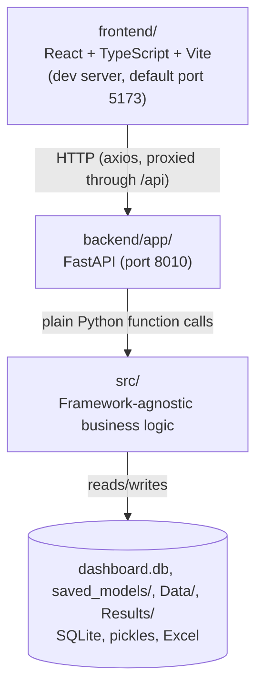
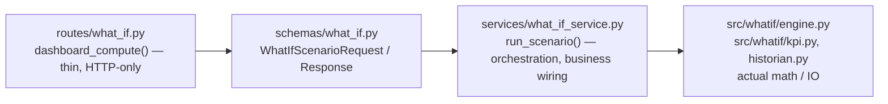
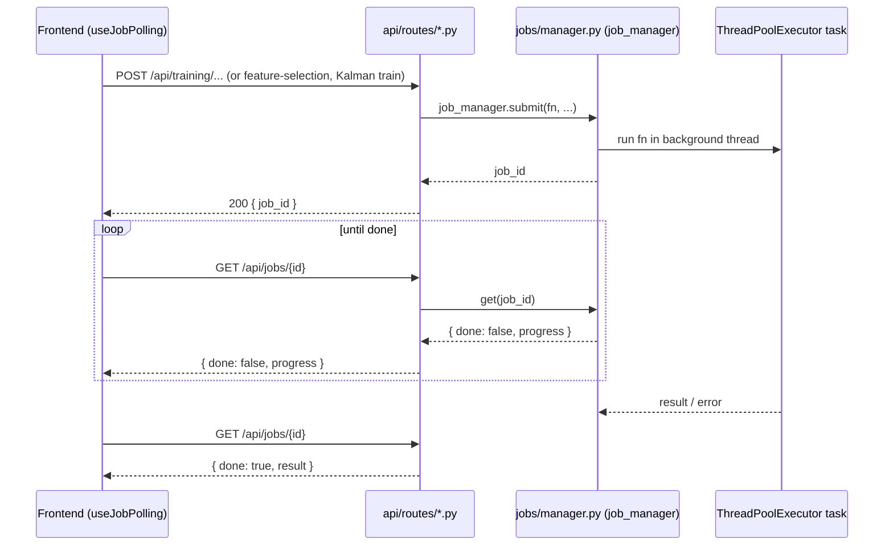
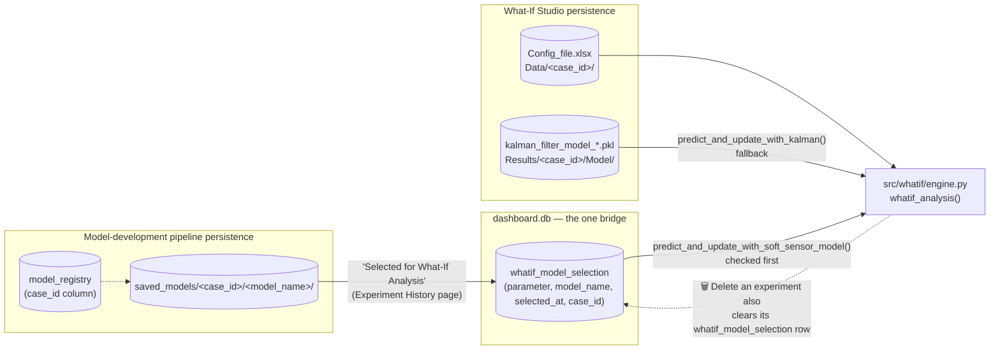
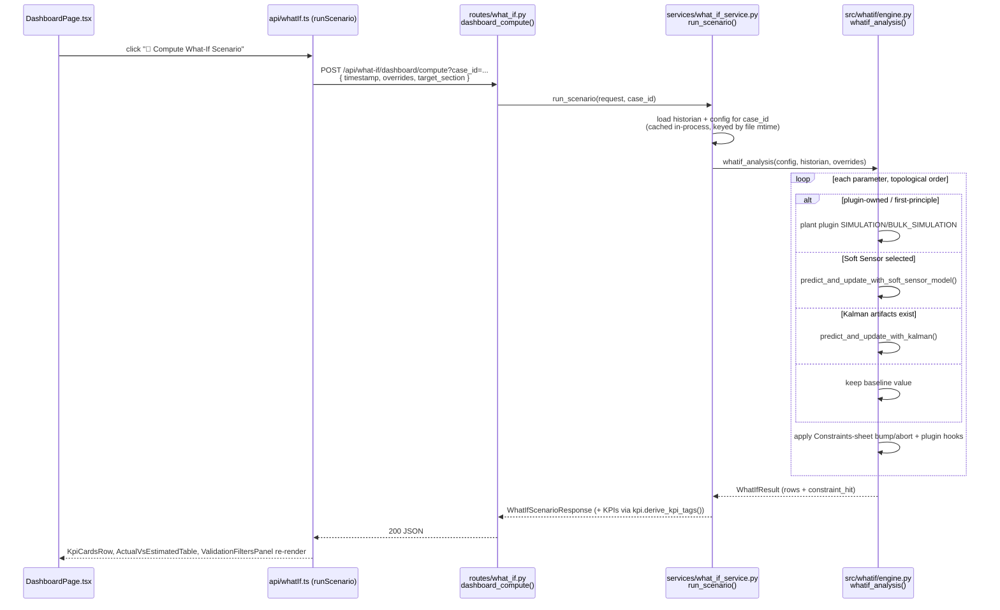

# SoftSense AI — Codebase Architecture & Workflow

A reference for *how the code is organized and how a request flows through it*. For setup/run instructions, see [`README.md`](../README.md). For the exact, screen-by-screen flow of the What-If Studio module specifically, see [`flow.md`](./flow.md).

---

## 1. The three layers

```
frontend/          React + TypeScript + Vite (dev server, default port 5173)
        ↕ HTTP (axios, proxied through /api)
backend/app/        FastAPI (port 8010)
        ↕ plain Python function calls
src/                Framework-agnostic business logic
        ↕ reads/writes
dashboard.db, saved_models/, Data/, Results/     Persistence (SQLite, pickles, Excel)
```



**The core rule: `src/` never imports FastAPI or React.** It's plain Python — testable and reusable independent of any UI. Everything web-specific (routes, request/response shaping, HTTP concerns) lives in `backend/app/`. Everything browser-specific (components, state, styling) lives in `frontend/src/`.

This is why the repo could support two very different frontends historically (a legacy Streamlit app in `Scripts/`, now read-only reference material, and the current React app) against the same `src/` logic.

---

## 2. Backend pattern: routes → schemas → services → src

Every backend feature follows the same 4-layer flow. Worked example — **What-If's scenario compute**:

1. **`backend/app/api/routes/what_if.py`**'s `dashboard_compute()` — thin FastAPI route. Parses/validates the request, calls exactly one service function, returns its result.
2. **`backend/app/schemas/what_if.py`** — Pydantic models for the request/response shape (`WhatIfScenarioRequest`, `WhatIfScenarioResponse`).
3. **`backend/app/services/what_if_service.py`**'s `run_scenario()` — the orchestrator. Loads the historian + config for the active case, calls into `src/`, reshapes the result into a plain dict/response model. This is where "business logic wiring" lives — not business logic itself.
4. **`src/whatif/engine.py`**'s `whatif_analysis()`, plus `src/whatif/kpi.py`, `historian.py` — the actual math/IO. Zero knowledge that a web framework exists.



`backend/app/main.py` wires every route module together:
```python
app.include_router(what_if.router, prefix="/api")
app.include_router(datasets.router, prefix="/api")
# ...
```

§5 below traces this exact request end to end, hop by hop.

**Long-running work doesn't block the request.** Training and feature selection use `backend/app/jobs/manager.py` — a `ThreadPoolExecutor`-backed singleton (`job_manager`). The route calls `job_manager.submit(fn, ...)`, gets a `job_id` back immediately, and the frontend polls `GET /api/jobs/{id}` (via the `useJobPolling` hook) until `done: true`. Fast operations (What-If scenario compute) skip this and respond synchronously.



---

## 3. Frontend pattern: page → api client → axios → backend

- **`frontend/src/api/*.ts`** — one file per backend domain (`training.ts`, `whatIf.ts`, ...). Each is a thin, typed wrapper around the shared `apiClient` (`api/client.ts` — axios, `baseURL: '/api'`). In dev, `vite.config.ts` proxies `/api` to `http://localhost:8010`.
- **`frontend/src/pages/<Feature>/<Feature>Page.tsx`** — a page composes: React Query `useQuery`/`useMutation` calls into the API layer, local `useState` for form/UI state, and shared components from `frontend/src/components/` (`Callout`, `DataTable`, `StatusCard`, `Tabs`, `MultiSelectDropdown`, `LineChart`/`ScatterChart`, ...) for layout.
- **`frontend/src/state/*Context.tsx`** — the only "global" client state: small `localStorage`-backed React Contexts for the few things that must survive page navigation (active dataset, active project, the What-If wizard's generated tag list + active Target Section, and `ActiveCaseContext` — the active case_id, read directly from `localStorage` by `api/client.ts`'s request interceptor since interceptors run outside React).
- **`frontend/src/layout/Sidebar.tsx`** + **`routes.tsx`** — the navigation shell. Each sidebar entry maps 1:1 to a route.

**Notable constraint:** no UI component library (no MUI/AntD/Tailwind) and no charting library. Everything is hand-rolled CSS (`theme.css`, CSS custom properties) and custom SVG chart components. New pages should follow this convention rather than introducing a library.

---

## 4. One product, two internal surfaces

What-If Studio is the product — the only thing with a sidebar entry and a landing page. It embeds a second surface, the **model-development pipeline** (what used to ship as a standalone "Soft Sensor Module"), purely as tabs inside its own Model Config section. That pipeline has no sidebar entry, no landing page, and no route a user is ever navigated to directly — `pages/Upload/`, `Preprocess/`, `FeatureSelection/`, `Train/`, `SoftSensor/ExperimentHistoryPage.tsx` are reused verbatim only as embedded tabs. Their standalone routes (`/upload`, `/preprocess`, `/soft-sensor-overview`, ...) were dead code — nothing in the UI linked to them — and have been removed from `routes.tsx`; `SoftSensor/OverviewPage.tsx` and `Predict/PredictPage.tsx`, which had zero other callers, were deleted outright.

| | **Model Development pipeline (embedded, no standalone nav)** | **What-If Studio (the product)** |
|---|---|---|
| How it's reached | Only via What-If Setup → Model Config → Model Development (5-phase stepper) | Sidebar: Welcome → What-If Setup (System Config / Model Config / What-If Config) → What-If Analysis |
| Frontend pages | `pages/Upload/`, `Preprocess/`, `FeatureSelection/`, `Train/` — reused verbatim as 4 of Model Development's 5 phases (the 5th, Model Definition, is `ModelMappingEditor.tsx`); their standalone routes were removed as dead code, along with the two pages that had no embedded caller at all (`SoftSensor/OverviewPage.tsx`, `Predict/PredictPage.tsx`, now deleted) | `pages/WhatIf/` — `WhatIfSetupPage.tsx` hosts 3 top-level tabs: `SystemConfigTab.tsx` (Process Flow Order / PI Tag Mapping / Input Tag Configuration), `ModelConfigTab.tsx` (Model Development's 5-phase stepper, embedding the pipeline on the left, plus Experimentation & Model Selection reusing `SoftSensor/ExperimentHistoryPage.tsx`), `WhatIfConfigTab.tsx` (Constraints/User Inputs/Results Layout). `DashboardPage.tsx` is the single flowing "What-If Analysis" page. |
| Backend routes | `datasets.py`, `preprocess.py`, `feature_selection.py`, `training.py` | `what_if.py` — case CRUD, config CRUD (8 sheets), wizard, training-data upload, model training/status, dashboard compute/validation, experiments overview/select/delete; every route takes a `case_id` query param |
| Core `src/` logic | `src/data/`, `src/feature_selection/`, `src/training/`, `src/models/`, `src/evaluation/` | `src/whatif/` (`config_io.py`, `historian.py`, `engine.py`, `wizard.py`, `model_status.py`, `kpi.py`, `plants/` — the plant-specific physics plugin package) |
| Persistence | `dashboard.db` (SQLite) + `saved_models/` (pickled models/scalers) — datasets, preprocessing projects (`artifacts/<project_id>/`), and the model registry are all case-scoped (see below) | `Data/<case_id>/Config_file.xlsx` (8 sheets), `Results/<case_id>/Model/*.pkl`, `Results/<case_id>/Raw_data_plus_simulated_data.xlsx` — a separate, file-based world, deliberately **mostly** kept apart from `dashboard.db` (see the one narrow bridge below), and isolated per **case** (`"default"` = the original flat layout, zero migration) |
| Reference implementation | — (built directly against this architecture) | `Scripts/whatif_runner.py`/`Whatif_streamlit_dashboard.py` and their `_updated` counterparts — **read-only** legacy Streamlit apps `src/whatif/` was ported from (the generalized dependency-graph engine and 8-sheet config schema came from the `_updated` versions). Never imported, never modified. **Exception**: `Scripts/Model_development_and_static_whatif_testing_updated.py` is not reference-only — it's the actual dedicated-Kalman-training implementation, invoked as a subprocess by `what_if_service._run_training_subprocess()` (see `flow.md` §4b), and gets bug-fixed like any other production file when needed. |

Both surfaces use the exact same routes→schemas→services→src backend layering and the exact same page→api→component frontend layering described above — once you understand one, you understand the shape of the other.

**The one deliberate bridge between the two persistence worlds:** Experiment History (`frontend/src/pages/SoftSensor/ExperimentHistoryPage.tsx`, reused inside Model Config's "Experimentation & Model Selection" tab) lets a user mark one model-development experiment (from `dashboard.db`'s `model_registry` / `saved_models/`) as **"Selected for What-If Analysis"** for a given Predicted Parameter. That selection is recorded in a `dashboard.db` table, `whatif_model_selection(parameter, model_name, selected_at, case_id)`. `src/whatif/engine.py::predict_and_update_with_soft_sensor_model()` checks this table before falling back to the dedicated Kalman filter for that parameter — see §5/`flow.md` for the exact dispatch order. This is intentionally the *only* place the two persistence worlds touch; everything else about their storage stays fully separate.

**Case isolation crosses that same bridge deliberately, once.** Since the two surfaces otherwise keep separate persistence, the natural boundary would leave the pipeline's side (`model_registry`, `saved_models/`) global while only What-If's own config/Kalman models were per-case — but a selection made in one case pointing at a model trained for a different case would be meaningless. So `model_registry` and `whatif_model_selection` both carry a `case_id` column, and `saved_models/<case_id>/<model_name>/` mirrors `Results/<case_id>/Model/`'s per-case layout. Deleting an experiment (Experiment History's 🗑️ button, `DELETE /api/what-if/experiments/{model_name}`) removes its `saved_models/` folder and registry row **and** clears any `whatif_model_selection` row pointing at it, so a case can never end up with a selection referencing a model that no longer exists. Isolation goes one step further than just the model layer: uploaded datasets (`dashboard.db`'s `datasets` table, `UNIQUE(case_id, name)`) and Feature Selection's `artifacts/<project_id>/` projects are case-scoped too — a new case starts with a genuinely blank Connect Data/Data Health/Feature Discovery, not a shared pool of every other case's uploads. See `flow.md` §2/§3a for the full mechanism (`ActiveCaseContext`, the `case_id` request interceptor, `whatif_case_service.py`).



---

## 5. One request, traced end-to-end

**What-If Studio's "Compute What-If Scenario" button:**

1. User clicks the button in `frontend/src/pages/WhatIf/DashboardPage.tsx` → calls `runScenario()` from `frontend/src/api/whatIf.ts`.
2. Axios POSTs to `/api/what-if/dashboard/compute` with a `WhatIfScenarioRequest` body (timestamp + overrides + `target_section`).
3. `backend/app/api/routes/what_if.py`'s `dashboard_compute()` route receives it, validated by the `schemas/what_if.py` Pydantic model, plus a `case_id` query param (defaulting to `"default"`, attached automatically by the frontend's request interceptor — see §4), and calls `what_if_service.run_scenario(..., case_id)` — nothing else.
4. `backend/app/services/what_if_service.py` loads the historian and config **for that case** (both cached in-process per case_id, keyed by file mtime, since the historian Excel file is expensive to parse) and calls `src/whatif/engine.py`'s `whatif_analysis()` — this function has no idea an HTTP request exists. It builds a dependency graph from the `Model details` sheet, walks it in topological order, and for every predicted parameter tries, in order: (a) a plant-plugin simulation function if the parameter is plugin-owned/first-principle, (b) a Soft-Sensor experiment marked "Selected for What-If Analysis" for that parameter (`predict_and_update_with_soft_sensor_model()`, the bridge described in §4), (c) the dedicated Kalman filter (`predict_and_update_with_kalman()`), (d) otherwise the baseline value is kept — with generic `Constraints`-sheet rules (bump/abort) and plugin hooks applied around each step. See `flow.md` for the exact per-parameter dispatch order and every file involved.
5. The service reshapes the returned `WhatIfResult` dataclass into a `WhatIfScenarioResponse` (rows + KPIs, the KPI tag list itself derived live via `src/whatif/kpi.py::derive_kpi_tags()` + constraint-hit flag); the route serializes it to JSON.
6. Back in `DashboardPage.tsx`, the `useMutation` resolves, the page auto-scrolls to the results, and `KpiCardsRow`, `ActualVsEstimatedTable`, and `ValidationFiltersPanel` re-render with the new data.



Use this as a template: any other flow (upload a dataset, submit a training job, generate a PI mapping) follows the same six-step shape with different files at each step. For the full, module-specific walkthrough of every screen and persistence path in What-If Studio, see **`flow.md`**.

---

## 6. Where things live (quick map)

```
backend/app/
├── main.py              # router registration, CORS, startup hook
├── api/routes/          # one file per feature — thin, HTTP-only
├── schemas/              # Pydantic request/response models
├── services/              # orchestration — calls src/, shapes responses (incl. whatif_case_service.py — case CRUD)
├── jobs/manager.py       # background job submit()/get() for long-running work
└── core/config.py        # CORS origins + re-exports of config.settings

frontend/src/
├── api/                  # one .ts file per backend domain, incl. cases.ts (case CRUD) + client.ts's case_id interceptor
├── pages/                # one folder per page, colocated sub-components
├── components/           # shared, hand-rolled UI (no library)
├── state/                # the few cross-page Contexts, incl. ActiveCaseContext.tsx
├── layout/                # Sidebar (also renders the "Case: <name> · Switch" pill) + Layout shell
└── routes.tsx             # route table — the model-development pipeline's old standalone routes (/upload, /preprocess, /soft-sensor-overview, ...) were dead code (unlinked from Sidebar.tsx) and have been removed; the reused pages themselves still live under pages/Upload/, Preprocess/, etc.

src/
├── data/, feature_selection/, training/, models/, evaluation/, persistence/   # Model-development pipeline logic
└── whatif/                # What-If Studio logic (config_io, historian, engine, wizard, model_status, kpi)
    └── plants/            # Plant-specific physics plugin (yanpet_olf1_formulas.py) — see engine.py's plugin contract

config/settings.py         # single source of truth for all paths/thresholds/defaults
```

For the fully-annotated setup-oriented version of this tree (with install/run commands), see the **Project Structure** section of [`README.md`](../README.md). For a complete, screen-by-screen walkthrough of What-If Studio specifically, see [`flow.md`](./flow.md).
